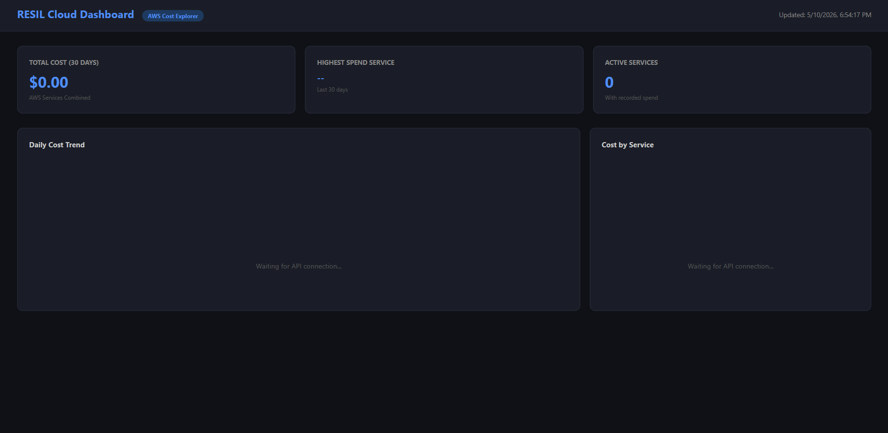

# Cloud Cost & Resource Monitoring Dashboard

**RESIL Technology Solutions LLC**
📍 Milwaukee, WI | Cloud Services & IT Consulting

## Overview
A real-time cloud cost and resource monitoring dashboard built with Python and AWS Cost Explorer API. Designed to help organizations track, visualize, and optimize their AWS cloud spending.

## Features
- Real-time AWS cost tracking by service
- Resource usage visualization
- Spend anomaly alerts
- Clean, responsive dashboard UI

## Tech Stack
- Python 3.12
- AWS Cost Explorer API
- AWS Boto3 SDK
- HTML/CSS/JavaScript
- Chart.js

## Dashboard Preview


## Setup

### Prerequisites
- Python 3.12+
- AWS Account (Free Tier)
- AWS CLI installed

### Installation

1. **Clone the repository**
```bash
   git clone https://github.com/RESILTechnologySolutions/resil-cloud-dashboard.git
   cd resil-cloud-dashboard
```

2. **Install dependencies**
```bash
   pip3 install boto3 flask python-dotenv
```

3. **Configure AWS credentials**
```bash
   aws configure
```
   Enter your AWS Access Key ID, Secret Access Key, and set region to `us-east-1`

4. **Enable AWS Cost Explorer**
   - Log into AWS Console
   - Navigate to Cost Explorer
   - Click Enable Cost Explorer
   - Wait up to 24 hours for data to populate

5. **Run the backend**
```bash
   cd backend
   python3 app.py
```

6. **Open the dashboard**
   - Open `frontend/index.html` in your browser
   - Dashboard will load and display your AWS cost data


## Author
RESIL Technology Solutions LLC
contact@resiltechnologysolutions.com
resiltechnologysolutions.com
